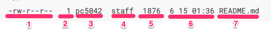

# File情報の取り扱い

## ファイル情報の確認方法と各セクションの意味

`ls -l`を実効することで、ファイルの情報を確認することができる。(もしくは`stat`を使う)  
コマンドを実効することで、下記のような情報を参照することができる。  

```cmd
mypedia % ls -l
-rw-r--r--   1 pc5042  staff  1876  6 15 01:36 README.md
```

各セクションが示す内容は下記の通り。



1. ファイルパーミッション : ファイル種別とファイルの権限を表している
2. ハードリンク数 : <meta ref="TODO:ハードリンクとは"/>
3. ファイル所有者 : ファイルの所有者を表している
4. 所有者グループ : ファイルの所有者が所属しているグループを表している
5. ファイル容量 : ファイル自体の容量
6. 更新日付 : ファイルの最終更新日付を表している
7. ファイル名 : ファイル名(場合によってはカレントまでのパス表示)


## Permissionの設定


| 読み取り | 書き込み | 実効  |
| :------: | :------: | :---: |
|    4     |    2     |   1   |
