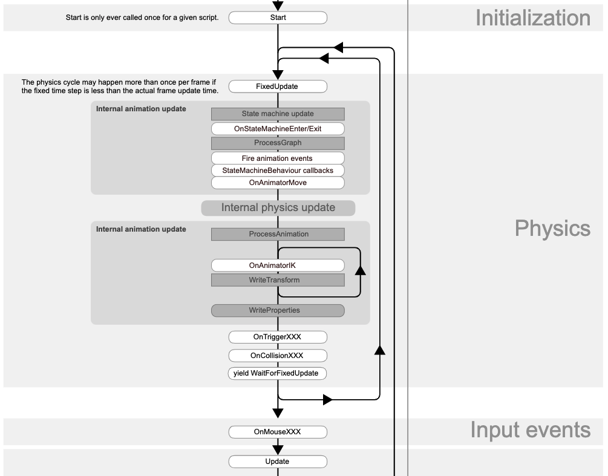

# Unity

## 【UpdateとFixedUpdateの違い】

UpdateとFixedUpdateは、UnityEngineとScript実行過程のLife Cycleを理解して使用しないと性能が悪くなるので注意が必要。  
UnityのLife Cycleについては[Order of execution for event functions](https://docs.unity3d.com/Manual/ExecutionOrder.html)を参照すること。

> 
> Order of execution for event functions
> <https://docs.unity3d.com/Manual/ExecutionOrder.html> より抜粋

## 【Unityでキー入力が複数回取得される現象】

## 【Unityのリポジトリフォルダ構造】

Unityにおけるリポジトリフォルダ構成については、[Unity Learn](https://learn.unity.com/)と呼ばれるUnity Technologiesが提供している学習サイトで取り上げされている。　　

Project Architecture: Unity Project Folder Structure
<https://learn.unity.com/tutorial/project-architecture-unity-project-folder-structure?uv=4.x#>

ものすごく端的にいって、リポジトリに含める必要があるのは、`Assets`と`ProjectSettings`のフォルダだけらしい。
> You’ll find that there are quite a lot of files and folders, good news that only two folders should be kept under source control: Assets and ProjectSettings. Others are generated from these two.

ただ、C#のProject的に`Packages`に記載されている依存情報も割と重要な情報なので、これも合わせて追加する。  
(実際に、上の記事で公開されている`.gitignore`には`Packages`を除外するような記載がない。)

## 【UnityにおけるC# Scriptの位置付け】

UnityにおけるC# Scriptの位置付けは、Unityが提供するAPI(Object)から値を取得するための`interface`といった印象。  
Script単体で存在するだけでは意味を持たず、対象のObjectにアタッチされることで初めて力を発揮する。  
C# Scriptの影響範囲は基本的にアタッチされたObjectに対してであり、Objectが持っているPropertyやComponentを`Get○○`などのInterfaceを介して取得する。  
そして、取得したComponentやObjectのPropertyに対して、**値を挿入したり**、**変更したり**することでObjectに変化をもたらしている。

## 【Objectを動かす]

Gameの基本である「Objectの動かす」については、いくつかの考え方がある。基本的には以下の3つを覚えておく。

1. Objectの座標を直接操作する。
2. Objectの速度を操作する。
3. Objectに外力を加える。

```cs
/*
 * Objectの座標を直接操作する。
 */
using UnityEngine;

public class PlayerMovement : MonoBehaviour
{
    void Update()
    {
        // トランスフォームのボジションに対して、Vector座標を追加していく。ポイントは追加していくところで、ただ代入するだけではない。
        // 追加していくことで、Updateが実行されるたびにPositionが、1.0f → 2.0f → 3.0fと変わるため、移動しているように見える。
        transform.position += new Vector3(1.0f, 0, 0);
    }
}
```

```cs
/*
 * Objectの速度を操作する.
 */
using UnityEngine;

public class PlayerMovement : MonoBehaviour
{
    private Rigidbody rb;
    void Start()
    {
        // 前提として、Rigitbodyのコンポーネントが付与されているObjectである必要がある。
        rb = GetComponent<Rigidbody>();
    }
    void Update()
    {
        // UpdateがCallされるたびに”Velocity：速度”のプロパティに対して、指定方向のVectorが渡される。
        rb.velocity = new Vector3(3f, 0, 0);
    }
}
```

```cs
/*
 * Objectの速度を操作する.
 */
using UnityEngine;

public class PlayerMovement : MonoBehaviour
{
    Rigidbody rb;
    void Start()
    {
        rb = GetComponent<Rigidbody>();
    }

    void Update()
    {
        // AddForceを使って、剛体(Rigitbody)に対して、外力を加えることでObjectを動かす。
        rb.AddForce(new Vector3(10, 0, 0));
    }
}
```


## 【Debug出力を行う】

UnityでDebug Console出力の確認を行う場合、普段のコーディングで使用している`System.Console.WriteLine()`は使用できない。
(※正確には使用はできるが、UnityUI上のConsole Windowには出力されない)
Unityの場合は、下記のメソッドを使用する。

```cs
using UnityEngine;

public class FirstScript : MonoBehaviour
{
    void Start()
    {
        // namespace UnityEngine 
        Debug.Log("Hello Logging");
    }
}


```

## 【UnityでVSCodeを使用する】

Utnityをそのまま使用しようとすると、DefaultのEditorはVisual Studioが選択させる。  
Visual Studioだと、重かったり、そもそもエディタを変更するのに抵抗がある場合はいろいろと辛いので、VSCodeを使用した方が個人的には良い。
ただ、VSCodeあるあるだが、あくまで拡張という位置づけなことが多いので単純に設定するだけだと、インテリセンスが反応しなかったりで辛い。  
そういったときは下記を参考にする。  

1. Monoがインストールされているか?
   Monoが何であるかは割愛するが、これがないとインテリセンスが反応しない。というかここにPackage群がいるので、こいつがいないとインテリセンスが読み込むための情報がないということになる。なので、まずは`mono`の存在を確認する。

   ```sh
   # Macの場合
   > mono --version
   Mono JIT compiler version 6.12.0.125 (2020-02/8c552e98bd6 Mon Mar  8 13:06:52 EST 2021)
   Copyright (C) 2002-2014 Novell, Inc, Xamarin Inc and Contributors. www.mono-project.com
        TLS:           
        SIGSEGV:       altstack
        Notification:  kqueue
        Architecture:  amd64
        Disabled:      none
        Misc:          softdebug 
        Interpreter:   yes
        LLVM:          yes(610)
        Suspend:       hybrid
        GC:            sgen (concurrent by default)
   ```

   情報が表示されればOK。何も表示されない場合は、`brew install mono`でInstallするか、<https://www.mono-project.com/download/stable/>直接サイトからダウンロードする。

2. OmniSharpの設定が行われているか。
   残念ながら、ただVSCodeをDefaultのエディタに設定するだけでは、設定が行われないらしい。

   ```json
   {
       /* ========== Mono ========== */
       "omnisharp.monoPath": "/Library/Frameworks/Mono.framework/Versions/Current",
       "omnisharp.useGlobalMono": "always",
   }
   ```

   `"omnisharp.monoPath"`には、MonoがInstallされているフォルダを選択する。ここで重要なのは、`/bin`を含んでいるフォルダをRootとして設定すること。  
   上のフォルダ場合は、`Current`ディレクトリ配下に`/bin`フォルダが存在しているので、ここを指定している。  
   `"omnisharp.useGlobalMono"`は`always`に設定している。`auto`に設定している状態で、MonoのVersionUpをするとインテリセンスが聞かないときがあるので、個人的には`always`の設定が無難。
